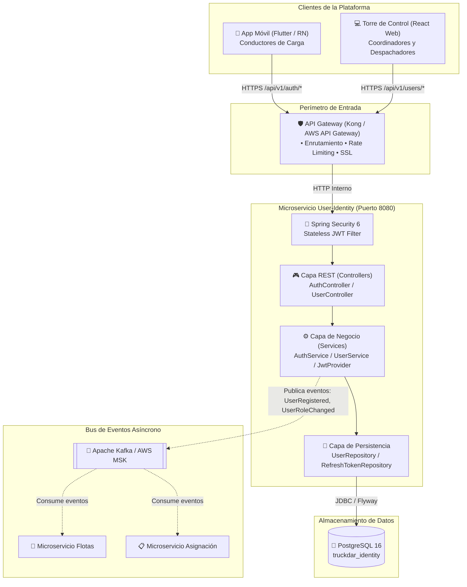
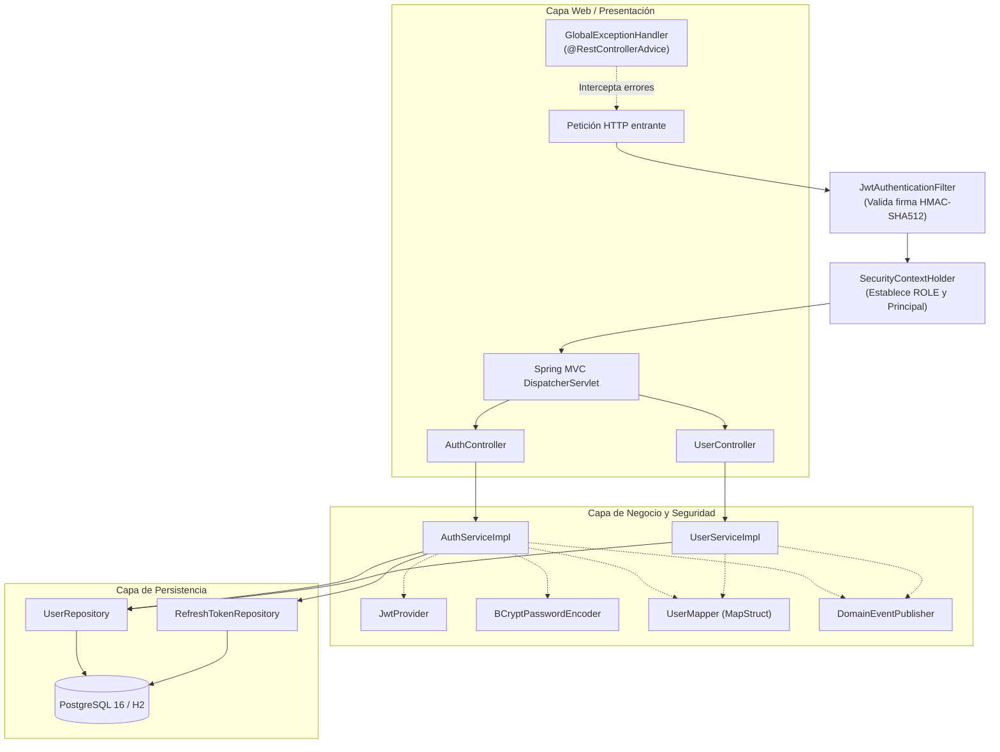
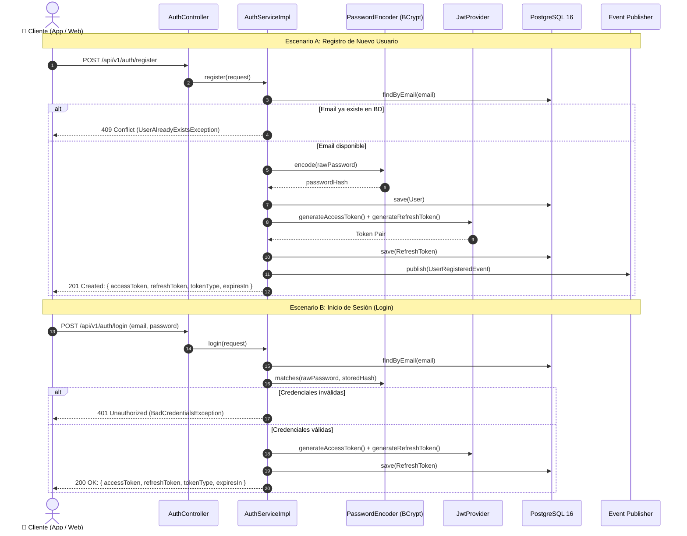
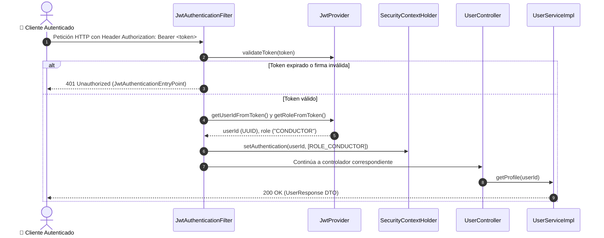
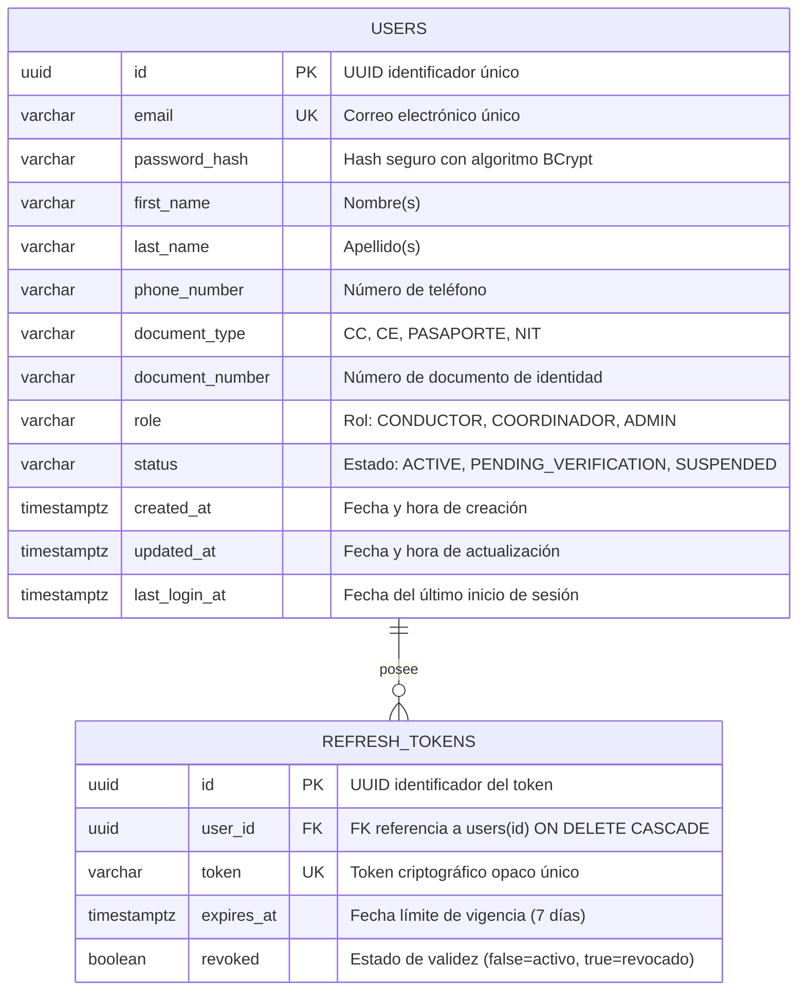

# TruckDar — User-Identity Microservice

Microservicio de **identidad, autenticación y autorización** de la plataforma
TruckDar. Gestiona el ciclo de vida de usuarios (conductores, coordinadores,
administradores), autenticación JWT (access + refresh tokens) y publica
eventos de dominio al bus de eventos compartido.

---

## Stack

| Tecnología | Versión |
|---|---|
| Java | 21 |
| Spring Boot | 3.3.5 |
| PostgreSQL | 16 |
| Flyway | Migraciones versionadas |
| JWT | jjwt 0.12.6 |
| MapStruct | 1.5.5.Final |
| Docker | Multi-stage build |

---

## Arquitectura del Microservicio

### 1. Diagrama de Contexto (Ecosistema TruckDar)



### 2. Arquitectura Interna por Capas



### 3. Flujo de Autenticación y Autorización (JWT)

#### 3.1. Flujo de Registro e Inicio de Sesión (Emisión de Tokens)



#### 3.2. Flujo de Validación de Petición Protegida y Control de Acceso (RBAC)



### 4. Modelo Entidad-Relación (Base de Datos)



---

## Requisitos previos

- **Java 21** (JDK)
- **Maven 3.9+** (o usar el wrapper `./mvnw`)
- **Docker** y **Docker Compose**

---

## Levantar localmente

### 1. Iniciar PostgreSQL con Docker Compose

```bash
docker compose up -d postgres
```

Esto levanta PostgreSQL en `localhost:5432` con:
- DB: `truckdar_identity`
- User: `truckdar`
- Password: `truckdar`

> **Tip:** También puedes levantar pgAdmin en `localhost:5050` con
> `docker compose up -d pgadmin`

### 2. Compilar y ejecutar el servicio

```bash
# Compilar (sin tests)
./mvnw clean package -DskipTests

# Opción A: Probar rápidamente en memoria (sin requerir Docker ni PostgreSQL)
./mvnw spring-boot:run "-Dspring-boot.run.profiles=standalone"

# Opción B: Ejecutar con PostgreSQL local (requiere Docker o Postgres en localhost:5432)
./mvnw spring-boot:run "-Dspring-boot.run.profiles=local"
```

El servicio arranca en `http://localhost:8080`.
*(En el modo `standalone`, la consola de base de datos H2 queda disponible en `http://localhost:8080/h2-console` con JDBC URL `jdbc:h2:mem:truckdar_identity` y usuario `sa`)*.

### 3. Acceder a Swagger UI

```
http://localhost:8080/swagger-ui.html
```

---

## Ejecutar tests

### Tests unitarios

```bash
./mvnw test
```

### Tests de integración (requiere Docker para Testcontainers)

```bash
./mvnw verify
```

> Los tests de integración usan **Testcontainers** para levantar una
> instancia de PostgreSQL real automáticamente — no necesitas tener
> Postgres corriendo manualmente.

---

## Build con Docker

```bash
# Construir la imagen
docker build -t truckdar/user-identity:latest .

# Ejecutar el contenedor
docker run -p 8080:8080 \
  -e DB_URL=jdbc:postgresql://host.docker.internal:5432/truckdar_identity \
  -e DB_USERNAME=truckdar \
  -e DB_PASSWORD=truckdar \
  -e JWT_SECRET=dHJ1Y2tkYXItdXNlci1pZGVudGl0eS1zZWNyZXQta2V5LWJhc2U2NC1lbmNvZGVkLWF0LWxlYXN0LTI1Ni1iaXRz \
  -e SPRING_PROFILES_ACTIVE=local \
  truckdar/user-identity:latest
```

---

## Endpoints principales

| Método | Ruta | Descripción |
|---|---|---|
| `POST` | `/api/v1/auth/register` | Registro de usuario |
| `POST` | `/api/v1/auth/login` | Login (access + refresh token) |
| `POST` | `/api/v1/auth/refresh` | Renovar access token |
| `POST` | `/api/v1/auth/logout` | Revocar refresh token |
| `GET` | `/api/v1/users/me` | Perfil del usuario autenticado |
| `PUT` | `/api/v1/users/me` | Actualizar perfil propio |
| `GET` | `/api/v1/users/{id}` | Consultar usuario (ADMIN/COORDINADOR) |
| `GET` | `/api/v1/users` | Listado paginado (ADMIN) |
| `PATCH` | `/api/v1/users/{id}/status` | Suspender/reactivar (ADMIN) |
| `PATCH` | `/api/v1/users/{id}/role` | Cambiar rol (ADMIN) |

---

## Variables de entorno

| Variable | Descripción | Default |
|---|---|---|
| `DB_URL` | JDBC URL de PostgreSQL | `jdbc:postgresql://localhost:5432/truckdar_identity` |
| `DB_USERNAME` | Usuario de la BD | `truckdar` |
| `DB_PASSWORD` | Contraseña de la BD | `truckdar` |
| `JWT_SECRET` | Secret para firmar JWTs (Base64) | *(dev default)* |
| `JWT_ACCESS_EXPIRATION` | TTL del access token (ms) | `900000` (15 min) |
| `JWT_REFRESH_EXPIRATION` | TTL del refresh token (ms) | `604800000` (7 días) |
| `SERVER_PORT` | Puerto del servidor | `8080` |

---

## Estructura del proyecto

```
src/main/java/escuelaing/edu/co/truckdar/User_Identity/
├── controller/          # REST controllers
├── service/             # Interfaces de lógica de negocio
│   └── impl/            # Implementaciones
├── repository/          # Spring Data JPA repositories
├── model/               # Entidades JPA + enums
├── dto/
│   ├── request/         # DTOs de entrada
│   └── response/        # DTOs de salida
├── mapper/              # MapStruct (entity <-> DTO)
├── security/            # JWT filter, SecurityConfig
├── exception/           # Excepciones + GlobalExceptionHandler
├── config/              # OpenAPI, beans de configuración
├── event/               # Eventos de dominio + publisher
└── UserIdentityApplication.java
```

---

## Perfiles de Spring

| Perfil | Uso |
|---|---|
| `standalone` | Prueba rápida en memoria (H2, sin requerir Docker/Postgres) |
| `local` | Desarrollo local (SQL logging, PostgreSQL) |
| `dev` | Ambiente compartido de desarrollo |
| `prod` | Producción (ECS Fargate) |
| `test` | Tests de integración |